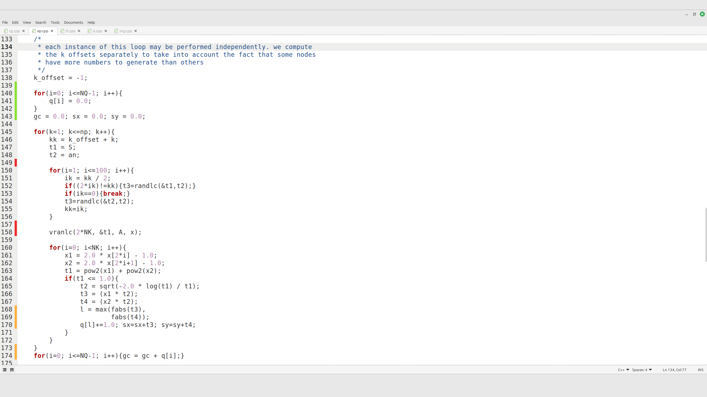

# xed-git

Git change markers for **Xed (Linux Mint)** — highlights lines that changed since the last commit.

## Features
- **Left gutter markers** showing what changed since last commit
  - **Green** = added
  - **Orange** = modified
  - **Red** = removed
- Tooltip preview for removed/modified hunks (when available)

## How it works
- Detects the Git repository containing the current file.
- Compares the current buffer contents against the file version in the last commit (`HEAD`).
- Draws markers in the left gutter using GtkSourceView’s gutter renderer.

## Usage
- Open any file inside a Git repository — gutter markers appear automatically.

## Install
### Dependencies (Linux Mint / Ubuntu / Debian)
```bash
sudo apt update
sudo apt install -y gir1.2-ggit-1.0 gir1.2-gtksource-3.0
```

### Copy folder
```bash
mkdir -p ~/.local/share/xed/plugins/
cp -r xed-git ~/.local/share/xed/plugins/
```

### Restart Xed and enable the plugin
**Edit → Preferences → Plugins → Xed Git**

## Debug
```bash
XED_DEBUG_GIT=1 xed
```

## Credits
- Based on the original **gedit Git plugin** by **Ignacio Casal Quinteiro** and **Garrett Regier**.
- Xed port by **Gabriell Araujo (2025)**.

## License
**GPL-2.0-or-later**

## Screenshots

### xed-git

