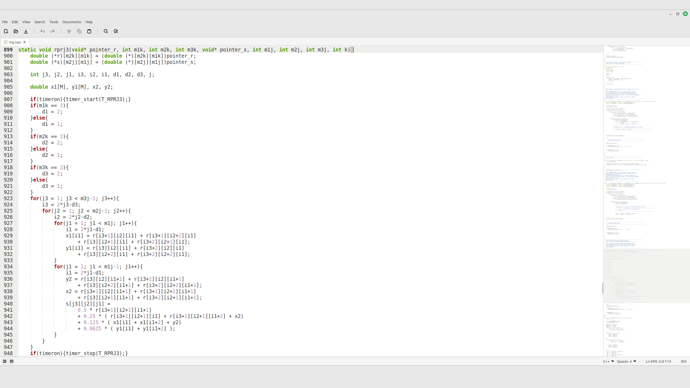

# xed-indentation-guides

Lightweight **indentation guides** for **Xed (Linux Mint)** — draws **VS Code-like vertical guides** inside the editor to make indentation structure easier to follow.

> Designed to be fast: it scans only a **window around the visible lines** (plus a limited back/forward scan), not the whole file.

## Features
- **VS Code-like indentation guides inside the editor**
  - thin, subtle vertical lines drawn in the text area
  - guides align to **tab-size blocks** (tab stops)
  - guides are drawn at the **beginning of each tab block** (VS Code-like):
    - level 1 → column 0
    - level 2 → column `tabw`
    - level 3 → column `2*tabw`
- **Whitespace-only logic (no language parsing)**
  - guides are based only on **leading whitespace** (spaces/tabs at the start of the line)
  - works for any language (C/C++, Python, Bash, Makefiles, etc.)
- **Theme-aware color**
  - uses the current GtkSourceView style scheme when possible
- **Efficient updates**
  - edits and scrolling are **coalesced** and recalculated on idle

## How it works
- Hooks into the editor drawing pipeline and renders thin vertical guides **inside the text area**.
- Guide X positions are computed from Xed/GtkSourceView’s **tab width** (tab stops).
- For each line, the plugin computes:
  - the line’s **leading whitespace columns** (tabs expanded using the current tab width)
  - an **indent level** in tab units (`leading_cols // tabw`)
- Guides are drawn only within the line’s leading whitespace area.
- Blank lines inherit the previous non-blank indent level so the guide structure remains visually continuous.

### Performance window
On changes/scroll, the plugin reads only a limited text window:
- visible lines
- plus `BACKSCAN_LINES` above and `FORWARD_LINES` below

## Usage
- Open any text/source file — indentation guides appear automatically.
- Scroll and edit normally; guides update on idle.

## Install
### Dependencies (Linux Mint / Ubuntu / Debian)
Usually already present on Linux Mint, but you can ensure the basics are installed:

```bash
sudo apt update
sudo apt install -y python3 python3-gi gir1.2-gtk-3.0
```

> Note: Xed already depends on GtkSourceView. If you are missing introspection packages for GtkSourceView on your distro, install the corresponding `gir1.2-gtksource-3.0` (or the matching version available).

### Copy folder
Copy the plugin directory into Xed’s per-user plugins folder:

```bash
mkdir -p ~/.local/share/xed/plugins/
cp -r xed-indentation-guides ~/.local/share/xed/plugins/
```

### Restart Xed and enable the plugin
**Edit → Preferences → Plugins → Xed Indentation Guides**

## Tuning (optional)
In `xed_indentation_guides.py`:

- `BACKSCAN_LINES`: how far above the visible region to scan
- `FORWARD_LINES`: how far below the visible region to scan

### Tab size
The guide alignment follows Xed’s configured **tab width**.  
Change it in Xed’s editor preferences — the plugin will follow automatically.

## Debug
Run Xed with debug enabled:

```bash
XED_DEBUG_INDENTATION_GUIDES=1 xed
```

## Known limitations
- This is not a full language parser/AST: guides are based only on **indentation**.
- Guides are computed from a window; extremely long indentation structures that begin far above
  `BACKSCAN_LINES` may not render until you scroll closer (or increase the backscan).
- Files with inconsistent indentation (mixed tabs/spaces, irregular tab width assumptions) may produce less intuitive guides.

## Credits
- Developed and maintained for Xed by **Gabriell Araujo (2025)**.
- Inspired by indentation guides in **Visual Studio Code**.

## License
**GPL-2.0-or-later**

## Screenshots

### xed-indentation-guides

