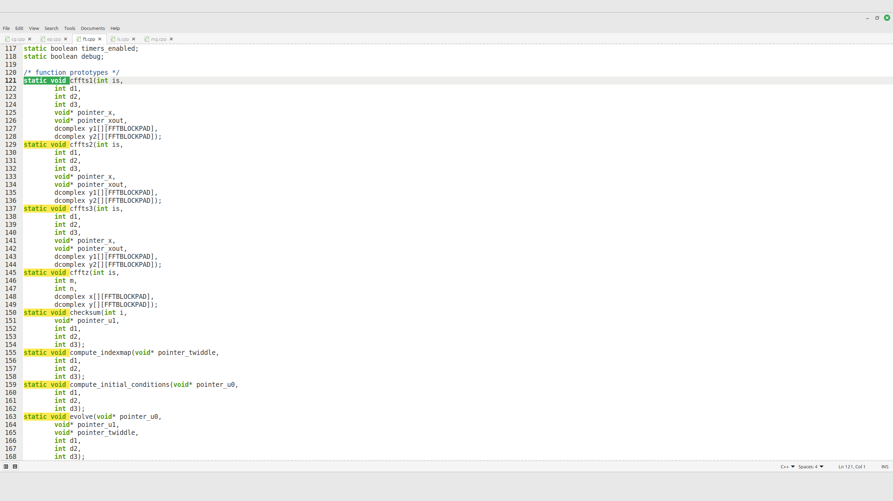

# xed-quick-highlight

Quick selection highlighting for **Xed (Linux Mint)** — highlights occurrences of the currently selected text.

## Features
- Highlights all matches of the selected text
- Works only for **non-empty, single-line** selections (avoids expensive multi-line patterns)
- Updates automatically while you move the caret or edit
- Uses the current GtkSourceView **style scheme** when available

## How it works
- Watches selection/cursor changes in the active view.
- When the selection is a single line and non-empty, searches for matches in the buffer.
- Applies lightweight highlight tags/styles (scheme-aware when possible).

## Usage
- Select a word (or any single-line text) to highlight all occurrences.
- Clear the selection to remove highlights.
- Multi-line selections are ignored on purpose.

## Install
### Dependencies (Linux Mint / Ubuntu / Debian)
```bash
sudo apt update
sudo apt install -y python3 python3-gi gir1.2-gtk-3.0 gir1.2-gtksource-3.0
```

### Copy folder
```bash
mkdir -p ~/.local/share/xed/plugins/
cp -r xed-quick-highlight ~/.local/share/xed/plugins/
```

### Restart Xed and enable the plugin
**Edit → Preferences → Plugins → Xed Quick Highlight**

## Debug
```bash
XED_DEBUG_QUICK_HIGHLIGHT=1 xed
```

## Credits
- Based on the original **gedit Quick Highlight plugin** by **Martin Blanchard**.
- Xed port by **Gabriell Araujo (2025)**.

## License
**GPL-2.0-or-later**

## Screenshots

### xed-quick-highlight

