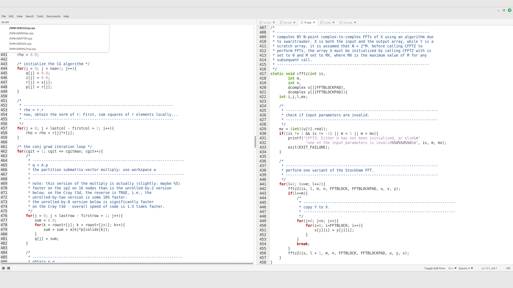
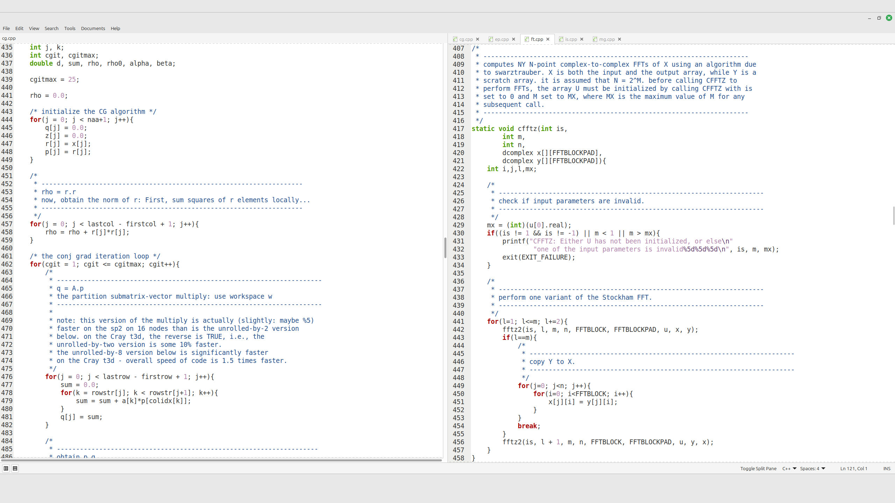

# xed-split-pane

A split workflow for **Xed (Linux Mint)** — keeps a **pinned editor pane on the LEFT** and normal **tabbed editor on the RIGHT**.

## Features
- **Pinned LEFT pane** + normal Xed tabs on the **RIGHT**
- **LEFT** pane stays fixed while you switch tabs on the **RIGHT**
- Minimal header: shows only the pinned filename
- Click the left filename to **choose from open tabs** (pinned entry is **bold**)
- Chooser lists **full paths/URIs** (useful when files share the same name)
- No overview/minimap on the left pane (right side behaves normally)
- **Scrollbars always visible** in both panes (non-overlay)
- **Font/zoom mirrored** between right active view and left pinned view
- Toggle split via:
  - Hotkey: **Ctrl+Alt+P** *(may not work on all setups)*
  - **View → Toggle Split Pane**
  - A clickable **"Toggle Split Pane"** text on the **status bar (right side)**

## How it works
- Creates a dedicated “pinned” view on the left and keeps it stable.
- Mirrors font/zoom from the currently active right-side view to the pinned view.
- Uses standard Xed tab documents; only the *view* is pinned.

## Usage
- Toggle split:
  - **Ctrl+Alt+P**, or
  - **View → Toggle Split Pane**, or
  - Click **"Toggle Split Pane"** on the **status bar (right side)**.
- When split is active:
  - **LEFT** shows the pinned file
  - **RIGHT** behaves like normal Xed tabs
  - Click the **left filename** to pick another open tab to pin

## Install
### Dependencies (Linux Mint / Ubuntu / Debian)
No extra dependencies beyond Xed’s default Python (GI) plugin support.

### Copy folder
```bash
mkdir -p ~/.local/share/xed/plugins/
cp -r xed-split-pane ~/.local/share/xed/plugins/
```

### Restart Xed and enable the plugin
**Edit → Preferences → Plugins → Xed Split Pane**

## Debug
```bash
XED_DEBUG_SPLIT_PANE=1 xed
```

## Credits
- Developed and maintained for Xed by **Gabriell Araujo (2025)**.
- Inspired by split workflow from **Geany**.

## License
**GPL-2.0-or-later**

## Screenshots

### xed-split-pane


