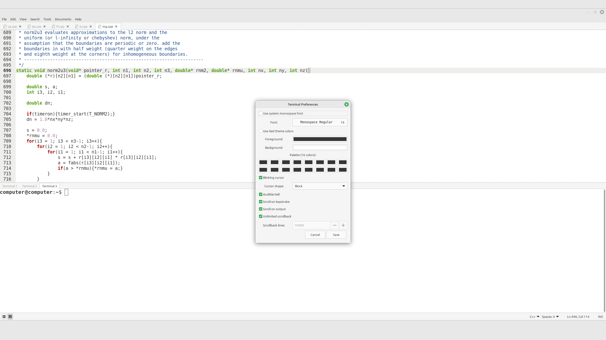

# xed-terminal

Embedded **VTE terminal** for **Xed (Linux Mint)** — shown in the **bottom pane** with **tabs** and a preferences dialog.

## Features
- VTE terminal embedded in Xed’s bottom panel
- Multiple terminal tabs (create/close)
- Right-click menu with:
  - Copy / Paste
  - Preferences
  - New / Close terminal tab
- Preferences:
  - Font (system monospace or custom)
  - Theme colors or custom foreground/background
  - Full **16-color ANSI palette**
  - Cursor blink + shape
  - Scrollback (unlimited or fixed lines)
  - Scroll on output / keystroke, audible bell

## How it works
- Uses VTE 2.91 (`gi.repository.Vte`) to spawn your default shell.
- Integrates into Xed’s **Bottom Pane** (so **View → Bottom Pane** toggles it).
- Stores per-user settings in:
  `~/.config/xed/plugins/xed-terminal/settings.ini`

## Usage
- Show/hide: **View → Bottom Pane**
- Right-click inside the terminal for actions and **Preferences**
- Shortcuts:
  - Copy: `Ctrl+Shift+C` (also `Ctrl+Insert`)
  - Paste: `Ctrl+Shift+V` (also `Shift+Insert`)
  - `Ctrl+C` is left untouched (SIGINT inside the terminal)

## Install
### Dependencies (Linux Mint / Ubuntu / Debian)
```bash
sudo apt update
sudo apt install -y libvte-2.91-0 gir1.2-vte-2.91
```

### Copy folder
```bash
mkdir -p ~/.local/share/xed/plugins/
cp -r xed-terminal ~/.local/share/xed/plugins/
```

### Restart Xed and enable the plugin
**Edit → Preferences → Plugins → Xed Terminal**

## Debug
```bash
XED_DEBUG_TERMINAL=1 xed
```

## Credits
- Based on the original **gedit embedded terminal plugin** by **Paolo Borelli**.
- Xed port by **Gabriell Araujo (2025)**.

## License
**GPL-2.0-or-later**

## Screenshots

### xed-terminal

